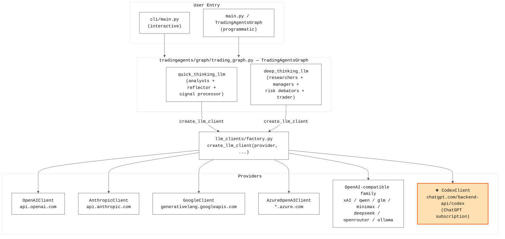
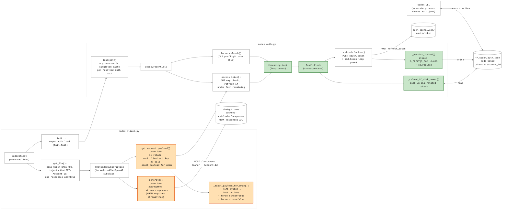
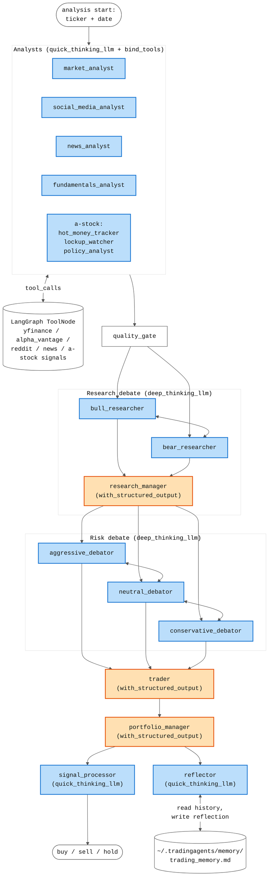

# TradingAgents architecture (post-Codex provider, 2026-05)

Three Mermaid diagrams at increasing zoom levels: top-level provider
dispatch, the Codex-subscription provider's internals, and the
LangGraph node flow.

The graph layer is intentionally provider-agnostic — every provider
honours the same three contracts (`bind_tools` returns OpenAI-format
`tool_calls`, `with_structured_output` returns a Pydantic instance,
`invoke()` is synchronous) so the orchestrator at the top doesn't
need to know whether a given run uses Platform API, Anthropic, or a
ChatGPT subscription.

## 1. Top-level dispatch

## 2. Codex provider internals

Two files implement everything Codex-specific. Orange blocks are
LangChain method overrides that adapt the WHAM Responses-API
divergences from native OpenAI. Green blocks are the concurrency /
persistence safety guards added after the GAN review.

## 3. LangGraph node flow

Provider-agnostic. Orange nodes use `with_structured_output` for typed
Pydantic results; blue nodes use plain `invoke()` (often with
`bind_tools`). The Codex provider satisfies both contracts, which is
why it slots in here without touching any graph code.

## Contracts that keep providers interchangeable

| # | Contract | Native OpenAI | Codex (WHAM) |
|---|---|---|---|
| 1 | `bind_tools()` returns OpenAI-format `tool_calls` | direct | via `_stream_responses` aggregation |
| 2 | `with_structured_output()` returns Pydantic instance | direct | direct (same Responses API) |
| 3 | `invoke()` synchronous semantics | direct | `_generate` collapses stream chunks |
| 4 | Token rotation invisible to LangChain | n/a (long-lived API key) | `_get_request_payload` writes `root_client.api_key` |
| 5 | Multiple in-process LLM instances share refresh state | n/a | `load()` is a per-path singleton |
| 6 | Doesn't race with the standalone `codex` CLI | n/a | `fcntl.flock` + `_reload_if_disk_newer` |
| 7 | Credential file mode `0o600` at all times | n/a | `os.open(O_CREAT\|O_EXCL, 0o600)` |
| 8 | Auth failures surface before the graph starts | env-var check | `force_refresh()` preflight in CLI |
